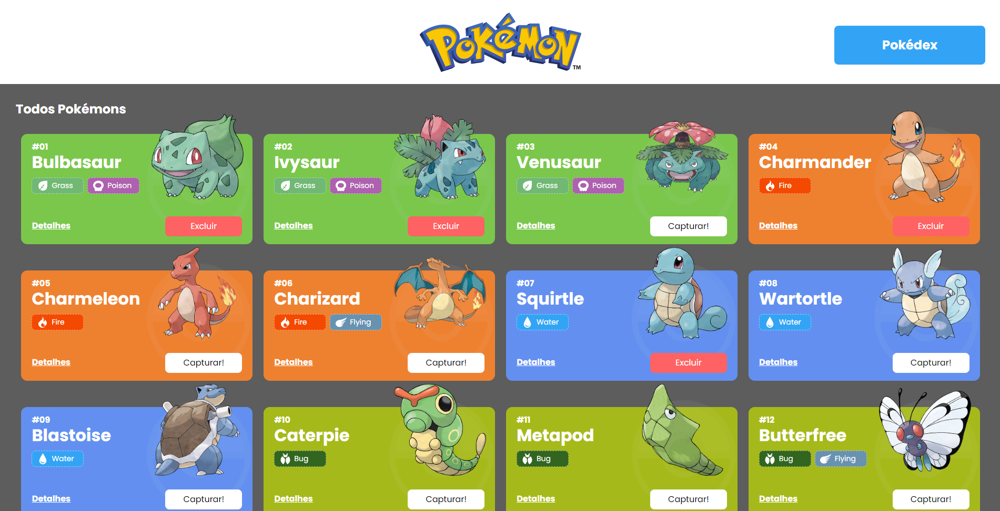
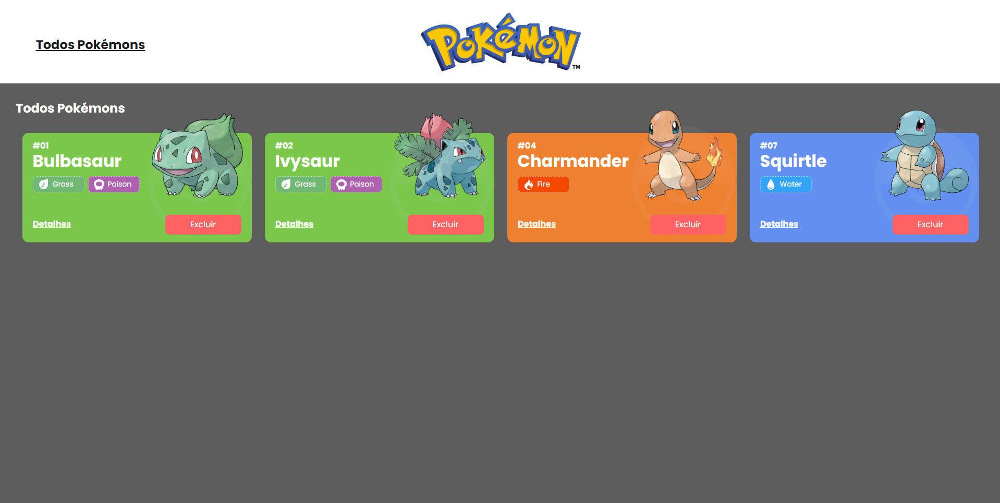
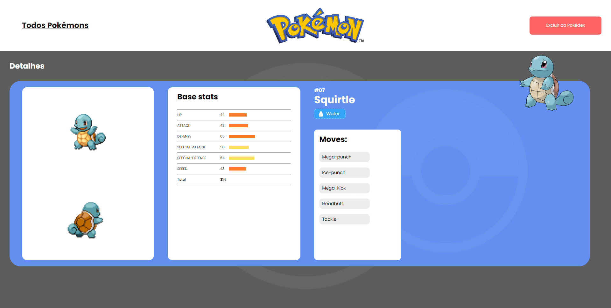

# Pokédex


Pokédex contendo todos os pokémons das 3 primeiras gerações.

## Índice
- <a hef="#func">Funcionalidades do projeto</a>
- <a hef="#layout">Layout</a>
- <a hef="#demo">Demonstração</a>
- <a hef="#howto">Como rodar este projeto</a>
- <a hef="#tech">Tecnologias Utilizadas</a>

<hr/>

## Funcionalidades do projeto

- Dados e atributos de cada pokémon
- Possibilidade de adicionar/remover pokémons à sua pokédex
- Notificação ao adicionar/remover um pokémon

## Layout




## Demonstração
[Link da demonstração](https://precious-starlight-78cd5a.netlify.app/)

## Como rodar este projeto
```bash
# Clone este repositório
$ git clone https://github.com/rodnikerson/projeto-react-apis

# Acesse a pasta do projeto no seu terminal
$ cd projeto-final-front

# Instale as dependências
$ npm i

# Execute a aplicação
$ npm start
```

## Tecnologias Utilizadas
1. React
2. React Router Dom
3. Axios
4. Context API
5. Styled-Components

Feito com muito carinho por **Rodolpho Nikerson** :)
